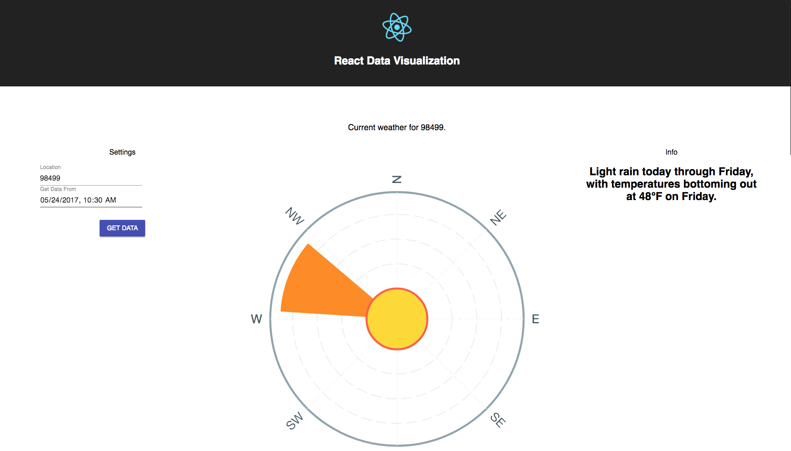
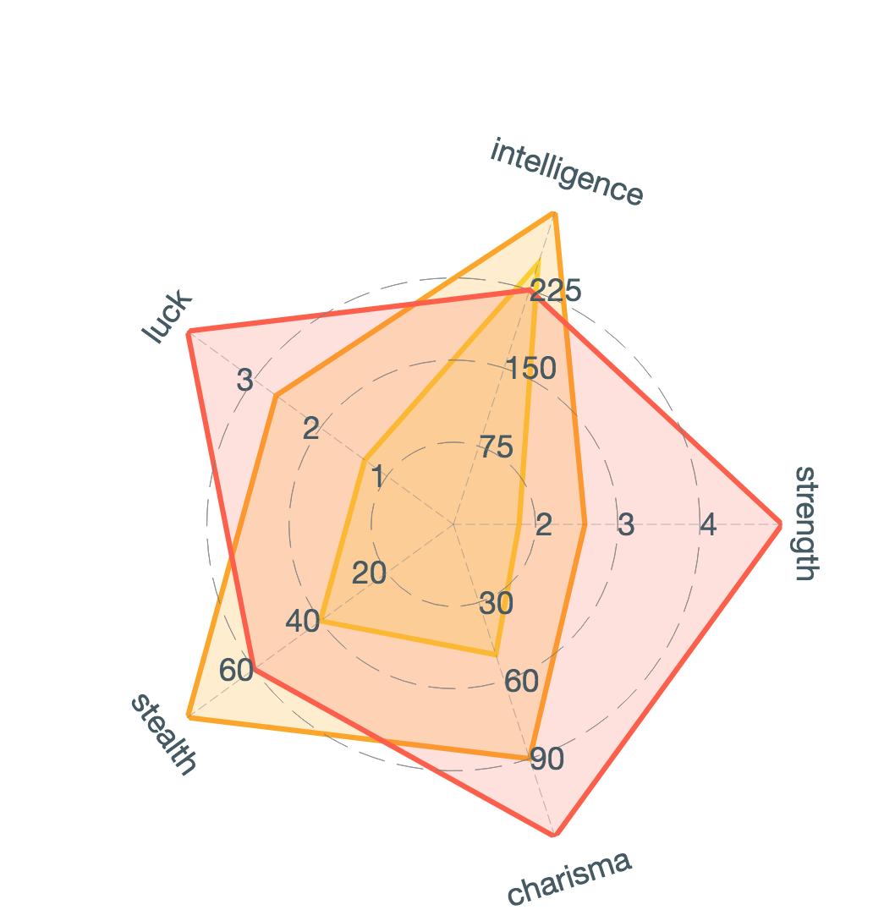

# This project is aimed to showcase React and Data Visualization

## `npm install`

## `npm run start`

## In a different terminal

## `cd server`

## `npm run start`

## If global map isn't rendering!

* Go here and see if web gl is supported
  http://mapbox.github.io/mapbox-gl-supported
* If not, and you're using chrome, do this...

* Navigate to chrome://flags/
* Enable 'Override software rendering list'

## .env config

* You need to make a .env file and place it inside the root of the server folder
* It should look like this

  * DARKSKY_SECRET_KEY='darkSkySecretKeyHere'

* You also need to make a .env file and place it at the root of this project folder
* It should look like this

  * REACT_APP_MAP_BOX_TOKEN='mapBoxTokenKeyHere'
